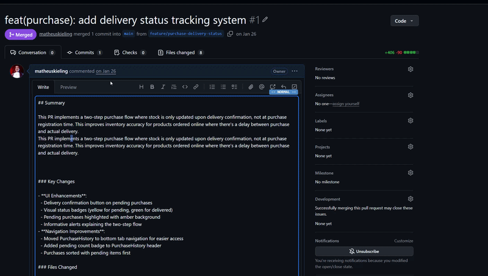
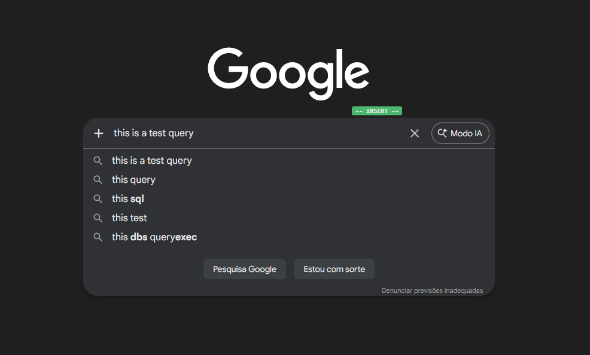
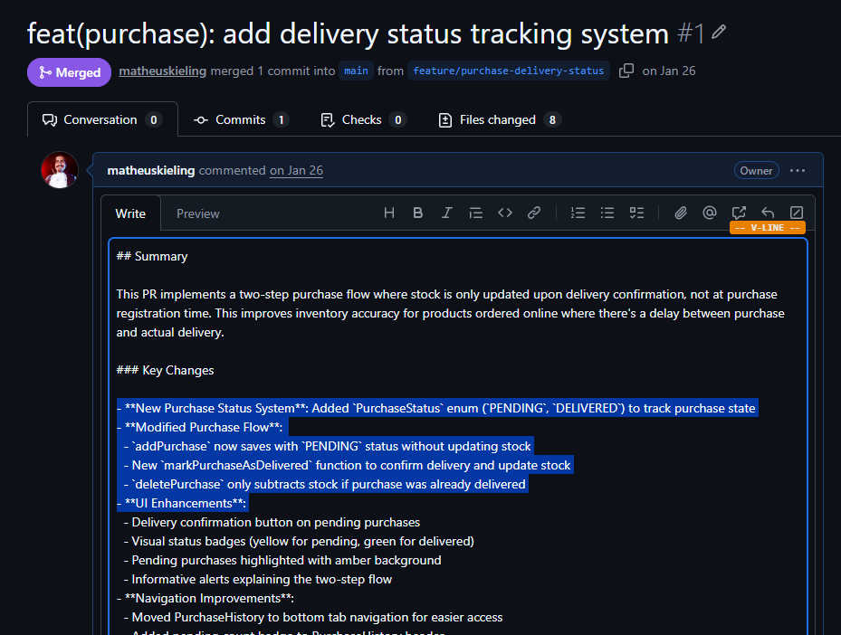
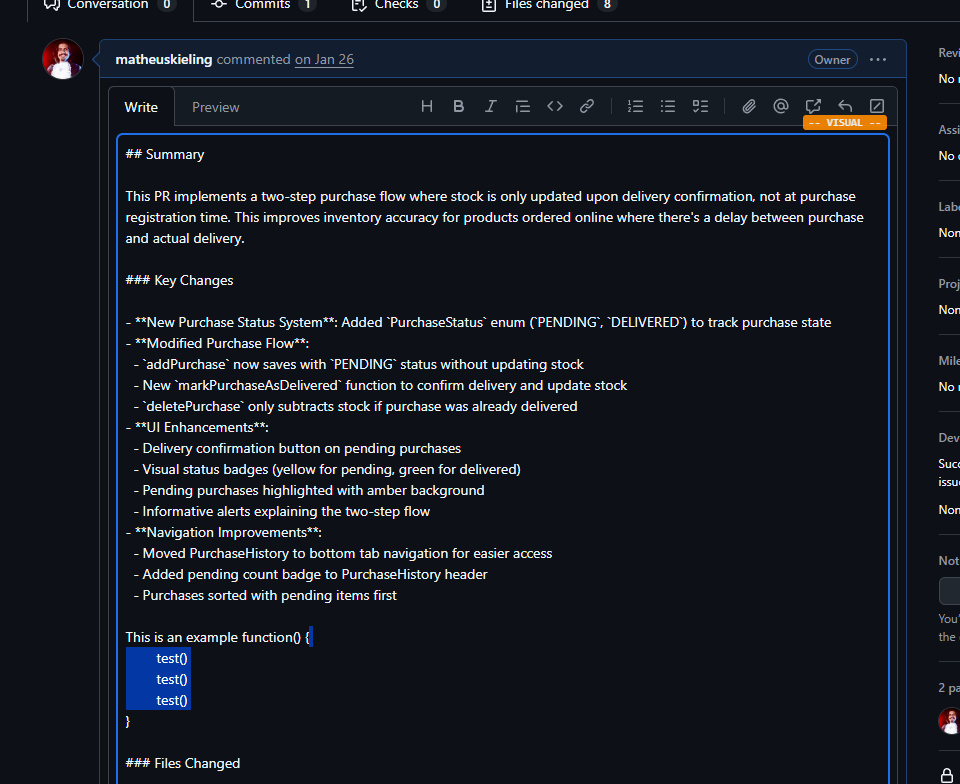

<p align="center">
  
</p>

<h1 align="center">Input Vim</h1>

<p align="center">
  <strong>Vim keybindings for every text input in the browser.</strong><br>
  A Chrome extension that brings the full power of Vim motions to <code>&lt;input&gt;</code>, <code>&lt;textarea&gt;</code>, and <code>contenteditable</code> elements.
</p>

<p align="center">
  
  
</p>

<p align="center">
  
</p>

---

## Limitations

- **Complex input fields**: Some web applications use heavily customized input components that go beyond standard `<input>`, `<textarea>`, or `contenteditable` elements. The extension may not work correctly (or at all) in these cases.
- **Unsupported input types**: Chrome restricts selection API access on `<input type="number">`, so the extension cannot operate on these fields.
- **Line wrapping**: There is partial support for navigating visually wrapped lines (e.g., `j`/`k` moving within a wrapped line), but it does not work reliably in all cases.
- **No active maintenance**: This project was built for my own personal use and is shared as-is for anyone who might find it useful in their workflow. There are no plans for ongoing maintenance, feature requests, or bug fixes.

---

## Why

Browser inputs are painful for anyone used to Vim. Moving by word, deleting to end of line, or selecting a paragraph all require reaching for the mouse or memorizing OS-specific shortcuts. Input Vim drops a lightweight Vim layer on top of any text field so you can stay on the home row.

## Features

- **Four modes** &mdash; Normal, Insert, Visual, and Visual Line
- **Full motion system** &mdash; word, line, find/till character, document start/end, and more
- **Operators** &mdash; delete, change, yank &mdash; composable with any motion or text object
- **Text objects** &mdash; `iw`, `aw`, `i(`, `a{`, `i"`, and more
- **Count prefixes** &mdash; `3w`, `5j`, `2dd` &mdash; repeat any motion or command
- **Registers** &mdash; yank/paste with optional system clipboard sync
- **Undo/Redo** &mdash; per-element undo stack independent of the browser
- **Visual overlay** &mdash; mode badge, block cursor, and pending command display via Shadow DOM
- **Configurable** &mdash; start mode, bracket matching, tab size, yank highlight, scroll jump size, site exclusions, and more
- **Works everywhere** &mdash; standard inputs, textareas, and contenteditable (rich text editors, GitHub PR descriptions, Notion, etc.)

<p align="center">
  
  <br>
  <em>Insert mode &mdash; type normally with the green mode indicator</em>
</p>

---

## Installation

1. Clone or download this repository
2. Open `chrome://extensions` in Chrome
3. Enable **Developer mode** (top-right toggle)
4. Click **Load unpacked** and select the project folder
5. The Input Vim icon appears in the toolbar

> No build step required &mdash; plain vanilla JavaScript.

---

## How It Works

Focus any text input, textarea, or contenteditable element on any page. You start in **Insert** mode &mdash; type normally. Press **Escape** to enter **Normal** mode, where single keys become Vim commands. Press **Escape** again in Normal mode to blur the input.

A small color-coded badge next to the input shows the current mode.

---

## Modes

| Mode | Badge | Description |
|------|-------|-------------|
| **Normal** | `-- NORMAL --` (blue) | Navigate and manipulate text. All keys are commands. |
| **Insert** | `-- INSERT --` (green) | Type text normally. Only `Escape`, `Tab`, and bracket matching are intercepted. |
| **Visual** | `-- VISUAL --` (orange) | Character-wise selection. Motions extend the selection. |
| **Visual Line** | `-- V-LINE --` (orange) | Line-wise selection. Operates on full lines. |

<p align="center">
  
  <br>
  <em>Visual Line mode &mdash; select entire lines on a GitHub PR</em>
</p>

---

## Keybindings

### Mode Switching

| Key | Action |
|-----|--------|
| `Escape` | Insert &rarr; Normal &rarr; blur |
| `i` | Insert before cursor |
| `a` | Insert after cursor |
| `I` | Insert at start of line |
| `A` | Insert at end of line |
| `o` | Open new line below and enter Insert |
| `O` | Open new line above and enter Insert |
| `v` | Enter Visual mode (toggle) |
| `V` | Enter Visual Line mode (toggle) |
| `:q` | Disable vim on the current input (reactivates on refocus) |

### Motions

All motions support count prefixes (e.g. `3w` moves 3 words forward).

#### Character & Line

| Key | Motion |
|-----|--------|
| `h` | Move left |
| `l` | Move right |
| `j` | Move down one line |
| `k` | Move up one line |
| `0` | Start of line |
| `^` | First non-blank character |
| `$` | End of line |

#### Word

| Key | Motion |
|-----|--------|
| `w` | Next word start |
| `b` | Previous word start |
| `e` | Next word end |
| `W` | Next WORD start (whitespace-delimited) |
| `B` | Previous WORD start |
| `E` | Next WORD end |

#### Find / Till

| Key | Motion |
|-----|--------|
| `f{char}` | Jump to next `{char}` on the line |
| `F{char}` | Jump to previous `{char}` on the line |
| `t{char}` | Jump to just before next `{char}` |
| `T{char}` | Jump to just after previous `{char}` |
| `;` | Repeat last `f`/`F`/`t`/`T` |
| `,` | Repeat last `f`/`F`/`t`/`T` in reverse |

#### Search

| Key | Motion |
|-----|--------|
| `/{term}` | Search forward for `{term}` (case insensitive) |
| `*` | Search forward for the word under cursor (whole word) |
| `n` | Jump to next search match |
| `N` | Jump to previous search match |

#### Document

| Key | Motion |
|-----|--------|
| `gg` | Go to start of document |
| `G` | Go to end of document |
| `Ctrl+D` | Scroll down (configurable line count) |
| `Ctrl+U` | Scroll up (configurable line count) |

### Operators

Operators compose with motions and text objects: `{operator}{motion}` or `{operator}{text object}`.

| Key | Operator | Examples |
|-----|----------|---------|
| `d` | Delete | `dw` delete word, `d$` delete to end of line, `dgg` delete to start |
| `c` | Change (delete + enter Insert) | `ciw` change inner word, `ct)` change till `)` |
| `y` | Yank (copy) | `yy` yank line, `y3w` yank 3 words |

#### Line Operations (doubled operator)

| Key | Action |
|-----|--------|
| `dd` | Delete entire line |
| `cc` | Change entire line |
| `yy` | Yank entire line |

### Text Objects

Text objects select structured regions of text. Use with operators (`diw`, `ca"`) or in Visual mode (`viw`).

| Key | Text Object |
|-----|-------------|
| `iw` / `aw` | Inner / around word |
| `iW` / `aW` | Inner / around WORD (whitespace-delimited) |
| `i(` / `a(` | Inner / around parentheses `()` |
| `i{` / `a{` | Inner / around braces `{}` |
| `i[` / `a[` | Inner / around brackets `[]` |
| `i<` / `a<` | Inner / around angle brackets `<>` |
| `i"` / `a"` | Inner / around double quotes |
| `i'` / `a'` | Inner / around single quotes |

<p align="center">
  
  <br>
  <em>Text objects &mdash; select inside braces, quotes, and more</em>
</p>

### Editing Commands

| Key | Action |
|-----|--------|
| `x` | Delete character under cursor |
| `X` | Delete character before cursor |
| `s` | Substitute character (delete + enter Insert) |
| `r{char}` | Replace character under cursor with `{char}` |
| `D` | Delete from cursor to end of line |
| `C` | Change from cursor to end of line |
| `Y` | Yank entire line |
| `p` | Paste after cursor |
| `P` | Paste before cursor |
| `u` | Undo |
| `Ctrl+R` | Redo |
| `Tab` | Insert spaces (configurable width, Insert mode) |

### Visual Mode

In Visual or Visual Line mode, motions extend the selection. Text objects set the selection. Then apply an operator:

| Key | Action |
|-----|--------|
| `d` / `x` | Delete selection |
| `y` | Yank selection |
| `c` / `s` | Change selection (delete + enter Insert) |
| `o` | Swap cursor to other end of selection |

You can switch between Visual and Visual Line with `v` / `V`, or press the same key again to exit.

### Count Prefixes

Prefix any motion, operator, or command with a number to repeat it:

```
3w      → move 3 words forward
5j      → move 5 lines down
2dd     → delete 2 lines
10x     → delete 10 characters
3fa     → jump to the 3rd 'a' on the line
```

---

## Settings

Click the extension icon in the toolbar to open the settings popup.

| Setting | Description | Default |
|---------|-------------|---------|
| **Enabled** | Toggle the extension on/off globally | On |
| **Start in** | Mode when focusing an input (Insert or Normal) | Insert |
| **Match brackets** | Auto-close `()`, `{}`, `[]` in Insert mode; skip over closing brackets | Off |
| **Tab spaces** | Number of spaces inserted by `Tab` in Insert mode (2, 4, or 8) | 4 |
| **System clipboard** | Sync yank/paste with the OS clipboard | Off |
| **Highlight yank** | Flash highlight on yanked text | Off |
| **Ctrl+D/U lines** | Number of lines to jump with `Ctrl+D` / `Ctrl+U` | 20 |
| **Always centered** | Keep the cursor vertically centered in the viewport | Off |
| **Excluded sites** | URL patterns where the extension is disabled | None |

Settings sync across Chrome devices via `chrome.storage.sync`.

### Site Exclusion

Exclude sites using glob patterns:
```
*://github.com/*
*://mail.google.com/*
*://docs.google.com/*
```

You can exclude the current site with one click, manage exclusions as a list, or bulk-edit all patterns as text.

---

## Compatibility

| Element | Support | Notes |
|---------|---------|-------|
| `<input type="text">` | Full | Also `search`, `url`, `tel`, `password`, `email` |
| `<textarea>` | Full | Multiline with visual line wrapping |
| `contenteditable` | Full | GitHub, Notion, rich text editors, etc. |
| `<input type="number">` | Not supported | Chrome restricts selection API access |

On sites where Chrome's native UI swallows the Escape key (Google Search autocomplete, GitHub), the extension detects the resulting focus loss and treats it as an Escape press.

---

## Quick Reference

```
 NORMAL MODE
 ┌─────────────────────────────────────────────────────┐
 │  Movement      h j k l    w b e    W B E    0 ^ $   │
 │  Find/Till     f F t T    ; ,                        │
 │  Search        /{term}    *    n N                    │
 │  Document      gg G    Ctrl+D  Ctrl+U                │
 │                                                      │
 │  Operators     d c y    (compose with motions)       │
 │  Line ops      dd cc yy                              │
 │  Text objs     iw aw    i( a{    i" a'    i[ a<     │
 │                                                      │
 │  Edit          x X s    r{c}    D C Y    p P         │
 │  Undo/Redo     u    Ctrl+R                           │
 │                                                      │
 │  Mode          i a I A o O    v V    Escape    :q     │
 └─────────────────────────────────────────────────────┘

 INSERT MODE
 ┌─────────────────────────────────────────────────────┐
 │  Type normally. Only Escape, Tab, and bracket        │
 │  matching are intercepted.                           │
 └─────────────────────────────────────────────────────┘

 VISUAL / VISUAL LINE MODE
 ┌─────────────────────────────────────────────────────┐
 │  Motions extend selection. Apply operators:          │
 │  d x    y    c s    or use text objects: iw i(       │
 └─────────────────────────────────────────────────────┘
```

---

## Development

```bash
git clone https://github.com/your-username/input-vim.git
```

1. Go to `chrome://extensions`
2. Enable Developer mode
3. Click "Load unpacked" and select the project folder
4. Open `test.html` in Chrome to test all input types and keybindings

No build tools, no dependencies, no compilation &mdash; just plain JavaScript.

### Architecture

```
content/
├── page-escape-blocker.js          # Prevents sites from stealing focus (MAIN world)
├── command-types.js                # Enums: Mode, MotionType, OperatorType, TextObject
├── register.js                     # Singleton yank/paste register with clipboard sync
├── key-parser.js                   # State machine: keystrokes → command objects
├── vim-engine.js                   # Mode management and operator dispatch
├── overlay.js                      # Shadow DOM overlay: mode badge, block cursor
├── handlers/
│   ├── input-handler.js            # Vim operations for <input> and <textarea>
│   └── contenteditable-handler.js  # Vim operations for contenteditable elements
└── main.js                         # Orchestrator: focus tracking, events, settings

popup/                              # Settings UI
background/
└── service-worker.js               # Settings broadcast to all tabs
```

---

## License

MIT
